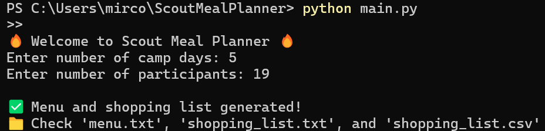
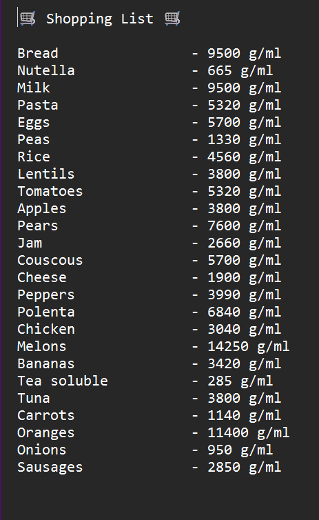
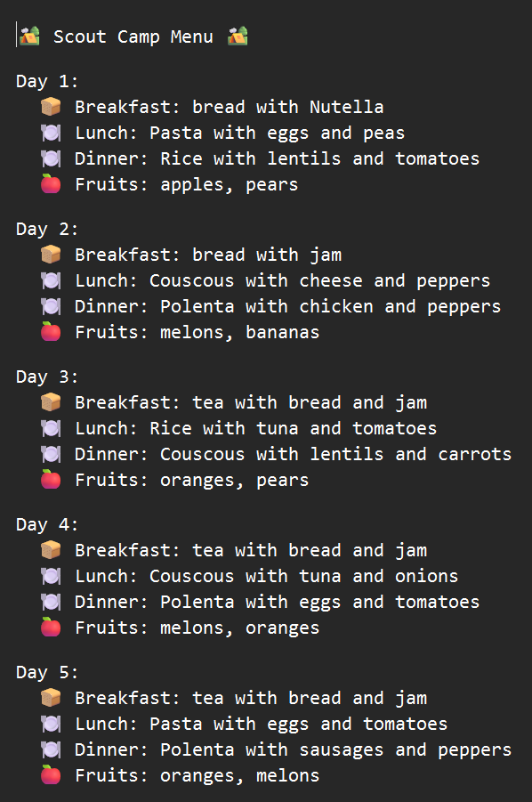

# 🏕️ Scout Meal Planner

 

A simple **Python app** to generate a **scout camp menu** and **shopping list** for **active teenagers (16-18 years old)**.  
The app is designed for camps where cooking is done **on a campfire** — no ovens or complex recipes required.

---

## 📸 Schreenshots 

<table align="center">
  <tr>
    <td align="center">
      <b>Terminal Interface</b><br>
    </td>
  </tr>  
   <tr>
      <td align="center">
      
      </td>
     <tr>
</table>


<table align="center">
  <tr>
    <td align="center">
      <b>Shopping List</b><br>
    </td>
    <td align="center">
      <b>Menu Overview</b><br>
    </td>
  </tr>  
      <td align="center">
      
      </td>
      <td align="center">
      
      </td>
</table>

---

## 🍽️ Features

- Generates **breakfast, lunch, and dinner** for each day of camp  
- Breakfast includes **bread with Nutella or jam + milk or tea**  
- Lunch and dinner are **simple meals**: carbs + protein + vegetables + fruits  
- Quantities are adjusted for **active teenagers** (ages 16–18)  
- Creates **shopping list** in both `.txt` and `.csv` format  
- **Random menu** each time you run the program

---

## 📂 Files in the repo

- `main.py` → Main program to generate menu and shopping list  
- `meals_data.py` → Ingredients and quantities  
- `requirements.txt` → No external libraries required  
- `README.md` → This file  

---

## 🚀 Try the Program Online

You can run `ScoutMealPlanner` directly in your browser without installing anything using Replit
How to run:
- Go to https://replit.com/
- Click “Create” → “Import from GitHub”
- Paste this repository link:
```
https://github.com/mirconegri/ScoutMealPlanner
```
Wait for the project to load, then click Run
✅ The program will start online, and you can interact with it (enter input, view output, etc.).

---

## ⚡ How to clone the repository and run

1. **Install Python 3** (if not already installed)
2. **Clone the repository:**
```
git clone https://github.com/mirconegri/ScoutMealPlanner.git
cd ScoutMealPlanner
```
3. **Run the app:**
```
python3 main.py
```
4. **Follow the prompts:**
- Enter the number of camp days
- Enter the number of participants

5. **Check the output files:**
- `menu.txt` → Daily menu
- `shopping_list.txt` → Ingredients for all meals
- `shopping_list.csv` → Shopping list in CSV format (easy to open in Excel/LibreOffice)

---

## 📝 Example Output

**Menu (menu.txt)**

Day 1:
  🍞 Breakfast: bread with Nutella
  🍽️ Lunch: Pasta with tuna and peppers
  🍽️ Dinner: Rice with sausages and zucchini
  🍎 Fruits: Apples, Oranges

Day 2:
  🍞 Breakfast: tea with bread and jam
  🍽️ Lunch: Couscous with beans and carrots
  🍽️ Dinner: Polenta with chicken and peas
  🍎 Fruits: Bananas, Pears

**Shopping List (shopping_list.txt)**

🛒 Shopping List 🛒

Bread                - 2000 g
Nutella              - 700 g
Milk                 - 5000 ml
Pasta                - 1400 g
Rice                 - 1200 g
Beans                - 1000 g
Sausages             - 1500 g
Chicken              - 1600 g
Peppers              - 700 g
Zucchini             - 800 g
Apples               - 2000 g
Oranges              - 2000 g

---

## 🛠️ Requirements

`Python 3.x`
No additional libraries needed

---

## 🎯 Purpose

This app is perfect for scout leaders or anyone organizing a camp for teenagers. It ensures:
Proper nutrition for active teens
Simple, easy-to-cook meals
Automatic shopping list generation

---

## 📌 Notes

Meals are randomized, so each run generates a different menu
Quantities are calculated per participant and per day
Breakfast options: `Nutella`, `jam`, `milk`, or `tea`
Meals are suitable for campfire cooking

---

## 📜 License

MIT License © 2025 `Mirco Negri`
— see [LICENSE](LICENSE) file for details.

---

## 👤 Author

`Mirco Negri`
GitHub: https://github.com/mirconegri

